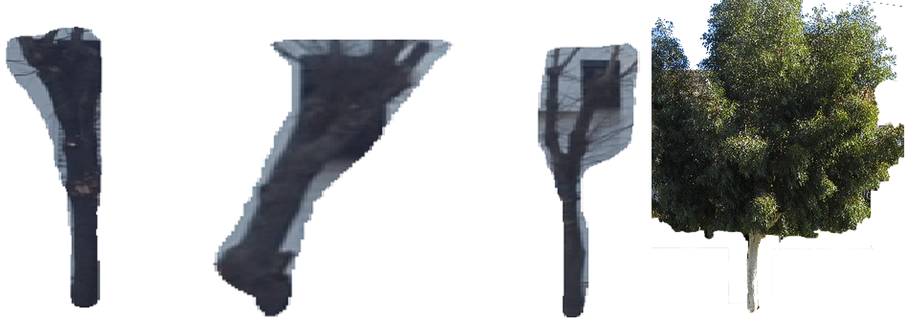

# Tree Detection on Street View Images by Mask R-CNN

## Introduction
Urban greenery plays a vital role in enhancing the quality of life in cities. Identifying and cataloging trees is a crucial step toward sustainable urban planning. This project leverages Mask R-CNN, a powerful deep learning model, to detect and segment trees in street-view images efficiently.

## Dataset
The dataset used in this study comprises 200 annotated images collected from the 27th Electrical Engineering Conference in Yazd, Iran. The images were preprocessed to sizes of 1024 &times; 1024 and 2048 &times; 2048 to evaluate model performance on different resolutions.

Example dataset image:

## Model Architecture
The architecture used for this project is Mask R-CNN, a state-of-the-art convolutional neural network designed for object detection and instance segmentation. The network extends Faster R-CNN by adding a branch for predicting segmentation masks on each detected object.

Architecture visualization:

## Results
The Mask R-CNN model demonstrated strong performance in detecting and segmenting trees. The results are summarized as follows:

- **Leafless trees**: IoU 91% (1024 &times; 1024), 92% (2048 &times; 2048)
- **Leafy trees**: IoU 92% (1024 &times; 1024), 95% (2048 &times; 2048)
- **Mixed trees**: IoU 92% (1024 &times; 1024), 93% (2048 &times; 2048)

Result visualizations:

## Authors

- **Fatemeh Jokar**: Lead developer and main contributor ([shekufeh.j@gmail.com](mailto:shekufeh.j@gmail.com))
- **Mahmood Amintoosi**: Primary supervisor ([m.amintoos@um.ac.ir](mailto:m.amintoos@um.ac.ir), [m.amintoos@hsu.ac.ir](mailto:m.amintoos@hsu.ac.ir))
- **Somayeh Sobati Moghadam**: Co-supervisor ([s.sobati@hsu.ac.ir](mailto:s.sobati@hsu.ac.ir))
- **Mehdi Zaferanieh**: Advisor ([mehdi.zaferanieh@gmail.com](mailto:mehdi.zaferanieh@gmail.com))

